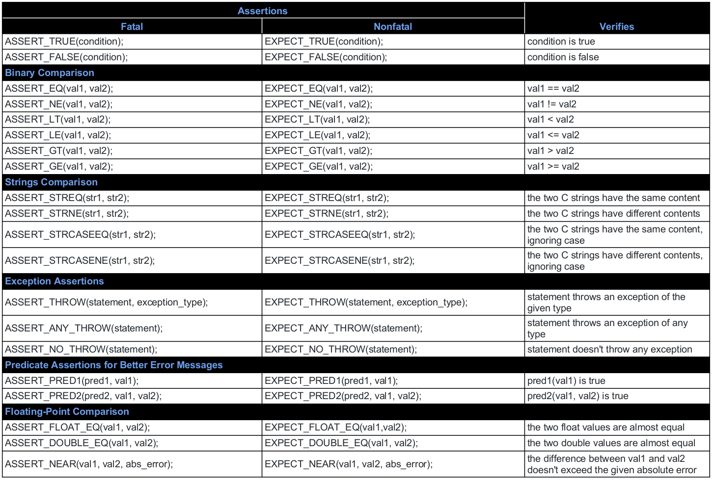

## TDD environment

This sample project contains setup for **c++** tdd learning environment with:

- Google test framework with html coverage report
- Meson build system
- Nix shell (dev-shell.nix) to manage dependencies and provide identical development environment

Workspace is configured by vscode with:

- google test adapter (plugin) settings
- Nix Environment Selector
- Launch settings for:
  - application 
  - unit test (required by google test debug)
- Tasks:
  - rebuild
  - generate coverage html report (only support run raw command because of meson limitation)
  - pack coverage report and binary to output folder

All library dependencies are handled by nix via dpkg. You can search dependencies [here](https://nixos.org/nixos/packages.html?channel=nixos-20.03).

Source code is example code from internet with dependencies of OpenSSL.

Google test helper:



## Best practices of tdd:

- **You should always do the next simplest test case.** 
  - This allows you to gradually increase the complexity of the code, refactoring as you go. 
  - This helps keep your code clean and understandable. If you jump to the complex cases too quickly, you can find yourself stuck writing a lot of code for one test case which breaks the short feedback cycle we look for with TDD. 
  - Beyond just slowing you down, this can also lead to bad design as you can miss some simple implementations that come from the incremental approach. 
- **Always use descriptive test names.** 
  - Code is read thousands of times more than it's written as the years go by. Making the code clear and understandable should be the top priority. 
  - Unit tests are the best documentation for the developers that come after you for how you intended your code to work. If they can't understand what the unit test is testing, that documentation value is lost. 
  - Test suites should name the class or function that is under test and the test names should describe the functionality that is being tested. 
- **Keep your unit tests building and running fast.** One of the biggest benefits of TDD is the fast feedback on how your changes have affected things. You lose this if the build and/or execution of your unit test is taking a long time, i.e., more than a few seconds. To help your test stay fast, try to keep the console output to a minimum or eliminated altogether. This output just slows down the test and clutters up the test results.
- **try to mock out any slow collaborators that are being used with test doubles that are fast.** 
- **Use code coverage analysis tools.** Once you've implemented all your test cases, go back and run your unit test through a code coverage tool. It can be surprising. Some of the areas of your code you'll miss, especially negative test cases. 
  - You should have a goal of 100% code coverage on functions with real logic. 
  - Don't waste your time on one-line getter and setter functions. 
- **make sure your unit tests run multiple times and in a random order.** Running your tests many times will help ensure that you don't have any flaky tests that are failing intermittently. Running your tests in random order ensures that your tests don't have dependencies between each other. You can use the gtest_repeat and gtest_shuffle command line parameters with your Google test-based unit test executables to do this.

## how to use

### Install the only dependency:

```nix
curl -L https://nixos.org/nix/install | sh
```

### follow instruction to setup vscode
[setup vscode](https://hanbo1990.com/2020/06/28/Set-Up-Python-Environment-with-NIX/)

### gcover :

```bash
# you need to check the fileds and use the one you have
gcov -b ${srcdir}/*.cpp -o ${obj dir} # obj dir is where gcda and gcno exists
lcov --capture --directory ../ --output-file lcoverage/main_coverage.info
genhtml lcoverage/main_coverage.info --output-directory lcoverage
```